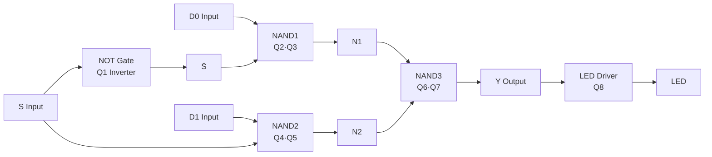

# Discrete 2-to-1 Multiplexer (RTL Implementation)

A fully discrete 2-to-1 multiplexer built from NPN transistors, resistors, and diodes — no ICs. This project demonstrates the physical threshold where analog voltage becomes a digital decision.

---

## view schematic online:
[Open on Kicanvas](https://kicanvas.org/?repo=https%3A%2F%2Fgithub.com%2Frowyfol%2FElec101%2Ftree%2Fmain%2FKiCad)

---

## Overview

| | |
|---|---|
| **Course** | Electronics I |
| **Components** | 8× 2N3904 (NPN), Resistors (1K, 10K, 330Ω), Diodes (1N4148), LED, Potentiometer |
| **Logic Family** | RTL (Resistor-Transistor Logic) |
| **Input** | D₀, D₁ (data), S (select) |
| **Output** | Y (drives LED via Q8 buffer) |

The MUX implements the standard Boolean equation using a NAND-NAND structure:

$$Y = (D_0 \cdot \overline{S}) + (D_1 \cdot S)$$

Decomposed into three NAND gates for transistor-level implementation:

$$Y = \overline{\overline{(D_0 \cdot \overline{S})} \cdot \overline{(D_1 \cdot S)}}$$

---

## Circuit Architecture

### Block Diagram



### Transistor-Level Schematic

```
+5V ────────────────────────────────────────────────
 │       │       │       │       │       │
[1K]   [1K]    [1K]    [1K]    [1K]   [330Ω]
 │       │       │       │       │       │
 ├─Q2─┐  ├─Q4─┐  ├─Q6─┐  │       │      LED
 │    │  │    │  │    │  │       │       │
D0   Q3  D1   Q5  N1   Q7  │       │      Q8
 │    │  │    │  │    │  │       │       │
 └─10K┘  └─10K┘  └─10K┘  │       │       │
    │       │       │      │       │       │
   GND     GND     GND    │       │      GND
                            │       │
                           Q1      [10K]
                            │       │
                            S───────┘
                           GND
```

### Stage Breakdown

| Stage | Transistors | Function | Equation |
|-------|-------------|----------|----------|
| **Inverter** | Q1 | Produces S̄ from S | $\overline{S}$ |
| **NAND1** | Q2, Q3 | Computes $\overline{D_0 \cdot \overline{S}}$ | $N_1 = \overline{D_0 \cdot \overline{S}}$ |
| **NAND2** | Q4, Q5 | Computes $\overline{D_1 \cdot S}$ | $N_2 = \overline{D_1 \cdot S}$ |
| **NAND3** | Q6, Q7 | Final output | $Y = \overline{N_1 \cdot N_2}$ |
| **Driver** | Q8 | LED buffer | $\text{LED} = Y$ |

---

## Truth Table

| $S$ | $D_0$ | $D_1$ | $N_1$ | $N_2$ | $Y$ | LED |
|:---:|:---:|:---:|:---:|:---:|:---:|:---:|
| 0 | 0 | 0 | 1 | 1 | 0 | OFF |
| 0 | 1 | 0 | 0 | 1 | 1 | ON |
| 0 | 1 | 1 | 0 | 1 | 1 | ON |
| 1 | 0 | 0 | 1 | 1 | 0 | OFF |
| 1 | 0 | 1 | 1 | 0 | 1 | ON |
| 1 | 1 | 0 | 1 | 0 | 0 | OFF |
| 1 | 1 | 1 | 1 | 0 | 1 | ON |

**Key observation:** When $S=0$, output follows $D_0$. When $S=1$, output follows $D_1$.

---

## The Threshold Crossing Demo

Instead of a digital switch for the Select input, a **10K potentiometer** is wired as a voltage divider:

$$V_{wiper} = V_{CC} \times \frac{R_2}{R_1 + R_2}$$

As the knob rotates from 0 to 5V, the input transistor Q1 crosses its base-emitter threshold:

| $V_{wiper}$ | Q1 State | $\overline{S}$ | MUX Selects |
|:---:|:---:|:---:|:---:|
| 0V → 0.6V | OFF (Cutoff) | HIGH (~5V) | **D₀** |
| **~0.7V** | **Threshold** | **Transition** | **Snap** |
| 0.8V → 5V | ON (Saturation) | LOW (~0.2V) | **D₁** |

The LED does not fade — it **snaps** from one state to the other at approximately **0.7V**, demonstrating the physical origin of digital logic.

---

## Measured Voltages (Verification)

| Node | Expected | Measured | Status |
|------|----------|----------|--------|
| Q1 Collector (S̄) | ~0V when S=HIGH | 26 mV | ✅ |
| Q2 Collector (NAND1) | ~5V when D₀=HIGH, S̄=LOW | 4.61 V | ✅ |
| Q4 Collector (NAND2) | ~5V when D₁=LOW | 4.61 V | ✅ |
| Q6 Collector (NAND3) | ~0V when both inputs HIGH | 57 mV | ✅ |

---
## Why Discrete?

No 74LS00. No 555. No microcontroller. Just transistors, resistors, and the physics of a PN junction crossing 0.7V.
