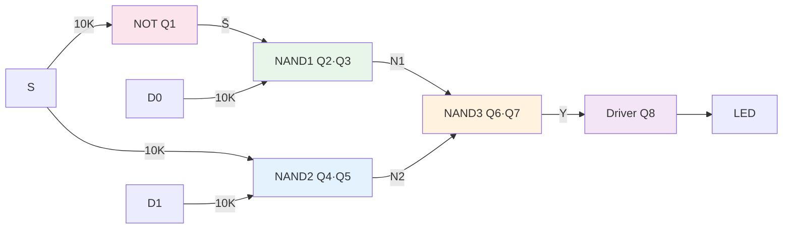

<div align="center">

# ⚡ Discrete 2-to-1 MUX: A Hypertext Circuit Explorer

**A fully transistor-level 2-to-1 multiplexer with interactive state simulation**  
*Built with 8× 2N3904, resistors, diodes — zero ICs*

[](#) [](#) [](#)

</div>

---

## 🎮 Interactive Control Panel

**Click any input combination below to jump to the live circuit state:**

| S | D₀ | D₁ | Expected Y | |
|:---:|:---:|:---:|:---:|:---:|
| [0](#state-000) | [0](#state-000) | [0](#state-000) | 0 (OFF) | [▶ Simulate](#state-000) |
| [0](#state-010) | [1](#state-010) | [0](#state-010) | 1 (ON) | [▶ Simulate](#state-010) |
| [0](#state-011) | [1](#state-011) | [1](#state-011) | 1 (ON) | [▶ Simulate](#state-011) |
| [1](#state-100) | [0](#state-100) | [0](#state-100) | 0 (OFF) | [▶ Simulate](#state-100) |
| [1](#state-101) | [0](#state-101) | [1](#state-101) | 1 (ON) | [▶ Simulate](#state-101) |
| [1](#state-110) | [1](#state-110) | [0](#state-110) | 0 (OFF) | [▶ Simulate](#state-110) |
| [1](#state-111) | [1](#state-111) | [1](#state-111) | 1 (ON) | [▶ Simulate](#state-111) |

**Or jump to the [Threshold Crossing Demo](#threshold-crossing) to see where analog becomes digital.**

---

## 📐 Circuit Architecture



**Boolean Equation:**

$$Y = (D_0 \cdot \overline{S}) + (D_1 \cdot S)$$

**NAND-NAND Implementation:**

$$Y = \overline{\overline{(D_0 \cdot \overline{S})} \cdot \overline{(D_1 \cdot S)}}$$

---

<a name="state-000"></a>
## 🔴 State: S=0, D₀=0, D₁=0

**Output: Y = 0 → LED OFF**

<details open>
<summary><b>Click to expand full circuit analysis</b></summary>

### Transistor States

| Transistor | Base Voltage | Condition | State | Collector |
|:---:|:---:|:---:|:---:|:---:|
| Q1 | 0V | S=0 | **OFF** | 5V (S̄=1) |
| Q2 | 0V | D₀=0 | **OFF** | — |
| Q3 | 5V | S̄=1 | **ON** | — |
| Q4 | 0V | D₁=0 | **OFF** | — |
| Q5 | 0V | S=0 | **OFF** | — |
| Q6 | 5V | N₁=1 | **ON** | — |
| Q7 | 5V | N₂=1 | **ON** | — |
| Q8 | 0.2V | Y=0 | **OFF** | — |

### Circuit Diagram (Live Voltages)

```
+5V ──[1K]──┬── N₁ = 5.0V (HIGH) ───────┬── Y = 0.2V (LOW) ───┬── LED = OFF
            │                           │                     │
           Q2(C)                       Q6(C)                 Q8(C)
            │                           │                     │
           Q2(B) ← 0.0V  OFF           Q6(B) ← 5.0V  ON      Q8(B) ← 0.2V  OFF
            │                           │                     │
           Q3(B) ← 5.0V  ON            Q7(B) ← 5.0V  ON      [10K]
            │                           │                     │
           Q3(E) ─── GND               Q7(E) ─── GND         GND

+5V ──[1K]──┬── N₂ = 5.0V (HIGH)
            │
           Q4(C)
            │
           Q4(B) ← 0.0V  OFF
            │
           Q5(B) ← 0.0V  OFF
            │
           Q5(E) ─── GND

+5V ──[1K]──┬── S̄ = 5.0V
            │
           Q1(C)
            │
           Q1(B) ← 0.0V  OFF
            │
           [10K]
            │
           GND
```

**Analysis:**
- NAND1: Q2 is OFF (D₀=0) → output N₁ stays HIGH (5V) regardless of Q3
- NAND2: Q4 is OFF (D₁=0) AND Q5 is OFF (S=0) → output N₂ stays HIGH (5V)
- NAND3: Both Q6 and Q7 are ON (N₁=5V, N₂=5V) → Y pulled to GND (~0.2V)
- Q8: Base at 0.2V → below V_BE threshold → LED OFF

</details>

---

<a name="state-010"></a>
## 🟢 State: S=0, D₀=1, D₁=0

**Output: Y = 1 → LED ON** ✅

<details>
<summary><b>Click to expand full circuit analysis</b></summary>

### Transistor States

| Transistor | Base Voltage | Condition | State | Collector |
|:---:|:---:|:---:|:---:|:---:|
| Q1 | 0V | S=0 | **OFF** | 5V (S̄=1) |
| Q2 | 5V | D₀=1 | **ON** | — |
| Q3 | 5V | S̄=1 | **ON** | — |
| Q4 | 0V | D₁=0 | **OFF** | — |
| Q5 | 0V | S=0 | **OFF** | — |
| Q6 | 0.3V | N₁=0 | **OFF** | — |
| Q7 | 5V | N₂=1 | **ON** | — |
| Q8 | 5V | Y=1 | **ON** | — |

### Circuit Diagram (Live Voltages)

```
+5V ──[1K]──┬── N₁ = 0.3V (LOW) ──────┬── Y = 5.0V (HIGH) ──┬── LED = ON ✅
            │                           │                     │
           Q2(C)                       Q6(C)                 Q8(C)
            │                           │                     │
           Q2(B) ← 5.0V  ON            Q6(B) ← 0.3V  OFF     Q8(B) ← 5.0V  ON
            │                           │                     │
           Q3(B) ← 5.0V  ON            Q7(B) ← 5.0V  ON      [10K]
            │                           │                     │
           Q3(E) ─── GND               Q7(E) ─── GND         GND

+5V ──[1K]──┬── N₂ = 5.0V (HIGH)
            │
           Q4(C)
            │
           Q4(B) ← 0.0V  OFF
            │
           Q5(B) ← 0.0V  OFF
            │
           Q5(E) ─── GND

+5V ──[1K]──┬── S̄ = 5.0V
            │
           Q1(C)
            │
           Q1(B) ← 0.0V  OFF
            │
           [10K]
            │
           GND
```

**Analysis:**
- NAND1: Both Q2 and Q3 are ON (D₀=1, S̄=1) → N₁ pulled LOW (~0.3V)
- NAND2: Q4 is OFF (D₁=0) → N₂ stays HIGH (5V)
- NAND3: Q6 is OFF (N₁=0.3V) → even though Q7 is ON, series path is broken → Y stays HIGH (5V)
- Q8: Base at 5V → fully ON → LED ON

**This is the correct MUX behavior:** S=0 selects D₀=1 → Y=1

</details>

---

<a name="state-011"></a>
## 🟢 State: S=0, D₀=1, D₁=1

**Output: Y = 1 → LED ON** ✅

<details>
<summary><b>Click to expand full circuit analysis</b></summary>

### Transistor States

| Transistor | Base Voltage | Condition | State | Collector |
|:---:|:---:|:---:|:---:|:---:|
| Q1 | 0V | S=0 | **OFF** | 5V (S̄=1) |
| Q2 | 5V | D₀=1 | **ON** | — |
| Q3 | 5V | S̄=1 | **ON** | — |
| Q4 | 5V | D₁=1 | **ON** | — |
| Q5 | 0V | S=0 | **OFF** | — |
| Q6 | 0.3V | N₁=0 | **OFF** | — |
| Q7 | 5V | N₂=1 | **ON** | — |
| Q8 | 5V | Y=1 | **ON** | — |

### Circuit Diagram (Live Voltages)

```
+5V ──[1K]──┬── N₁ = 0.3V (LOW) ──────┬── Y = 5.0V (HIGH) ──┬── LED = ON ✅
            │                           │                     │
           Q2(C)                       Q6(C)                 Q8(C)
            │                           │                     │
           Q2(B) ← 5.0V  ON            Q6(B) ← 0.3V  OFF     Q8(B) ← 5.0V  ON
            │                           │                     │
           Q3(B) ← 5.0V  ON            Q7(B) ← 5.0V  ON      [10K]
            │                           │                     │
           Q3(E) ─── GND               Q7(E) ─── GND         GND

+5V ──[1K]──┬── N₂ = 5.0V (HIGH)
            │
           Q4(C)
            │
           Q4(B) ← 5.0V  ON
            │
           Q5(B) ← 0.0V  OFF
            │
           Q5(E) ─── GND

+5V ──[1K]──┬── S̄ = 5.0V
            │
           Q1(C)
            │
           Q1(B) ← 0.0V  OFF
            │
           [10K]
            │
           GND
```

**Analysis:**
- Same as State 010. NAND1 pulls N₁ LOW because both Q2 and Q3 are ON.
- NAND2: Q5 is OFF (S=0) so N₂ stays HIGH regardless of Q4.
- NAND3: Q6 OFF → Y stays HIGH.
- MUX selects D₀=1 → Y=1

</details>

---

<a name="state-100"></a>
## 🔴 State: S=1, D₀=0, D₁=0

**Output: Y = 0 → LED OFF**

<details>
<summary><b>Click to expand full circuit analysis</b></summary>

### Transistor States

| Transistor | Base Voltage | Condition | State | Collector |
|:---:|:---:|:---:|:---:|:---:|
| Q1 | 5V | S=1 | **ON** | 0.2V (S̄=0) |
| Q2 | 0V | D₀=0 | **OFF** | — |
| Q3 | 0.2V | S̄=0 | **OFF** | — |
| Q4 | 0V | D₁=0 | **OFF** | — |
| Q5 | 5V | S=1 | **ON** | — |
| Q6 | 5V | N₁=1 | **ON** | — |
| Q7 | 5V | N₂=1 | **ON** | — |
| Q8 | 0.2V | Y=0 | **OFF** | — |

### Circuit Diagram (Live Voltages)

```
+5V ──[1K]──┬── N₁ = 5.0V (HIGH) ───────┬── Y = 0.2V (LOW) ───┬── LED = OFF
            │                           │                     │
           Q2(C)                       Q6(C)                 Q8(C)
            │                           │                     │
           Q2(B) ← 0.0V  OFF           Q6(B) ← 5.0V  ON      Q8(B) ← 0.2V  OFF
            │                           │                     │
           Q3(B) ← 0.2V  OFF           Q7(B) ← 5.0V  ON      [10K]
            │                           │                     │
           Q3(E) ─── GND               Q7(E) ─── GND         GND

+5V ──[1K]──┬── N₂ = 5.0V (HIGH)
            │
           Q4(C)
            │
           Q4(B) ← 0.0V  OFF
            │
           Q5(B) ← 5.0V  ON
            │
           Q5(E) ─── GND

+5V ──[1K]──┬── S̄ = 0.2V
            │
           Q1(C)
            │
           Q1(B) ← 5.0V  ON
            │
           [10K]
            │
           GND
```

**Analysis:**
- Q1 is ON (S=5V) → S̄ pulled LOW (~0.2V)
- NAND1: Q2 OFF (D₀=0) → N₁ stays HIGH
- NAND2: Q4 OFF (D₁=0) → N₂ stays HIGH
- NAND3: Both Q6 and Q7 ON → Y pulled LOW
- LED OFF

</details>

---

<a name="state-101"></a>
## 🟢 State: S=1, D₀=0, D₁=1

**Output: Y = 1 → LED ON** ✅

<details>
<summary><b>Click to expand full circuit analysis</b></summary>

### Transistor States

| Transistor | Base Voltage | Condition | State | Collector |
|:---:|:---:|:---:|:---:|:---:|
| Q1 | 5V | S=1 | **ON** | 0.2V (S̄=0) |
| Q2 | 0V | D₀=0 | **OFF** | — |
| Q3 | 0.2V | S̄=0 | **OFF** | — |
| Q4 | 5V | D₁=1 | **ON** | — |
| Q5 | 5V | S=1 | **ON** | — |
| Q6 | 5V | N₁=1 | **ON** | — |
| Q7 | 0.3V | N₂=0 | **OFF** | — |
| Q8 | 5V | Y=1 | **ON** | — |

### Circuit Diagram (Live Voltages)

```
+5V ──[1K]──┬── N₁ = 5.0V (HIGH) ───────┬── Y = 5.0V (HIGH) ──┬── LED = ON ✅
            │                           │                     │
           Q2(C)                       Q6(C)                 Q8(C)
            │                           │                     │
           Q2(B) ← 0.0V  OFF           Q6(B) ← 5.0V  ON      Q8(B) ← 5.0V  ON
            │                           │                     │
           Q3(B) ← 0.2V  OFF           Q7(B) ← 0.3V  OFF     [10K]
            │                           │                     │
           Q3(E) ─── GND               Q7(E) ─── GND         GND

+5V ──[1K]──┬── N₂ = 0.3V (LOW)
            │
           Q4(C)
            │
           Q4(B) ← 5.0V  ON
            │
           Q5(B) ← 5.0V  ON
            │
           Q5(E) ─── GND

+5V ──[1K]──┬── S̄ = 0.2V
            │
           Q1(C)
            │
           Q1(B) ← 5.0V  ON
            │
           [10K]
            │
           GND
```

**Analysis:**
- NAND2: Both Q4 and Q5 are ON (D₁=1, S=1) → N₂ pulled LOW (~0.3V)
- NAND1: Q3 is OFF (S̄=0.2V) → N₁ stays HIGH
- NAND3: Q7 is OFF (N₂=0.3V) → series path broken → Y stays HIGH
- Q8 ON → LED ON

**Correct MUX behavior:** S=1 selects D₁=1 → Y=1

</details>

---

<a name="state-110"></a>
## 🔴 State: S=1, D₀=1, D₁=0

**Output: Y = 0 → LED OFF**

<details>
<summary><b>Click to expand full circuit analysis</b></summary>

### Transistor States

| Transistor | Base Voltage | Condition | State | Collector |
|:---:|:---:|:---:|:---:|:---:|
| Q1 | 5V | S=1 | **ON** | 0.2V (S̄=0) |
| Q2 | 5V | D₀=1 | **ON** | — |
| Q3 | 0.2V | S̄=0 | **OFF** | — |
| Q4 | 0V | D₁=0 | **OFF** | — |
| Q5 | 5V | S=1 | **ON** | — |
| Q6 | 5V | N₁=1 | **ON** | — |
| Q7 | 5V | N₂=1 | **ON** | — |
| Q8 | 0.2V | Y=0 | **OFF** | — |

### Circuit Diagram (Live Voltages)

```
+5V ──[1K]──┬── N₁ = 5.0V (HIGH) ───────┬── Y = 0.2V (LOW) ───┬── LED = OFF
            │                           │                     │
           Q2(C)                       Q6(C)                 Q8(C)
            │                           │                     │
           Q2(B) ← 5.0V  ON            Q6(B) ← 5.0V  ON      Q8(B) ← 0.2V  OFF
            │                           │                     │
           Q3(B) ← 0.2V  OFF           Q7(B) ← 5.0V  ON      [10K]
            │                           │                     │
           Q3(E) ─── GND               Q7(E) ─── GND         GND

+5V ──[1K]──┬── N₂ = 5.0V (HIGH)
            │
           Q4(C)
            │
           Q4(B) ← 0.0V  OFF
            │
           Q5(B) ← 5.0V  ON
            │
           Q5(E) ─── GND

+5V ──[1K]──┬── S̄ = 0.2V
            │
           Q1(C)
            │
           Q1(B) ← 5.0V  ON
            │
           [10K]
            │
           GND
```

**Analysis:**
- NAND1: Q3 is OFF (S̄=0.2V) → N₁ stays HIGH
- NAND2: Q4 is OFF (D₁=0) → N₂ stays HIGH
- NAND3: Both Q6 and Q7 ON → Y pulled LOW
- LED OFF

**Correct MUX behavior:** S=1 selects D₁=0 → Y=0

</details>

---

<a name="state-111"></a>
## 🟢 State: S=1, D₀=1, D₁=1

**Output: Y = 1 → LED ON** ✅

<details>
<summary><b>Click to expand full circuit analysis</b></summary>

### Transistor States

| Transistor | Base Voltage | Condition | State | Collector |
|:---:|:---:|:---:|:---:|:---:|
| Q1 | 5V | S=1 | **ON** | 0.2V (S̄=0) |
| Q2 | 5V | D₀=1 | **ON** | — |
| Q3 | 0.2V | S̄=0 | **OFF** | — |
| Q4 | 5V | D₁=1 | **ON** | — |
| Q5 | 5V | S=1 | **ON** | — |
| Q6 | 5V | N₁=1 | **ON** | — |
| Q7 | 0.3V | N₂=0 | **OFF** | — |
| Q8 | 5V | Y=1 | **ON** | — |

### Circuit Diagram (Live Voltages)

```
+5V ──[1K]──┬── N₁ = 5.0V (HIGH) ───────┬── Y = 5.0V (HIGH) ──┬── LED = ON ✅
            │                           │                     │
           Q2(C)                       Q6(C)                 Q8(C)
            │                           │                     │
           Q2(B) ← 5.0V  ON            Q6(B) ← 5.0V  ON      Q8(B) ← 5.0V  ON
            │                           │                     │
           Q3(B) ← 0.2V  OFF           Q7(B) ← 0.3V  OFF     [10K]
            │                           │                     │
           Q3(E) ─── GND               Q7(E) ─── GND         GND

+5V ──[1K]──┬── N₂ = 0.3V (LOW)
            │
           Q4(C)
            │
           Q4(B) ← 5.0V  ON
            │
           Q5(B) ← 5.0V  ON
            │
           Q5(E) ─── GND

+5V ──[1K]──┬── S̄ = 0.2V
            │
           Q1(C)
            │
           Q1(B) ← 5.0V  ON
            │
           [10K]
            │
           GND
```

**Analysis:**
- NAND2: Both Q4 and Q5 ON → N₂ pulled LOW
- NAND3: Q7 OFF → Y stays HIGH
- Q8 ON → LED ON

**Correct MUX behavior:** S=1 selects D₁=1 → Y=1

</details>

---

<a name="threshold-crossing"></a>
## ⚡ The Threshold Crossing Demo

**The most interesting part of this project:** Instead of a digital switch for the Select input, a **10K potentiometer** is wired as a voltage divider.

### The Potentiometer Circuit

```
+5V ───[10K Potentiometer]─── GND
            │
         Wiper
            │
            └──→ S (to Q1 base via 10K resistor)
```

**Equation:**

$$V_{wiper} = V_{CC} \times \frac{R_2}{R_1 + R_2}$$

### What Happens When You Turn the Knob

| $V_{wiper}$ | Q1 State | $\overline{S}$ | MUX Behavior |
|:---:|:---:|:---:|:---|
| **0.0V → 0.6V** | OFF (Cutoff) | HIGH (~5V) | LED shows **D₀** state |
| **~0.7V** | **Threshold** | **Transition** | LED **snaps** suddenly |
| **0.8V → 5.0V** | ON (Saturation) | LOW (~0.2V) | LED shows **D₁** state |

### The Physics

A BJT is governed by the diode equation:

$$I_C \approx I_S \cdot e^{V_{BE}/V_T}$$

Where $V_T = kT/q \approx 26\text{mV}$ at room temperature.

Because of this exponential relationship, a change of just **60mV** in $V_{BE}$ changes the collector current by a factor of **10×**. This is why the transition looks like a "digital switch" even though it is fundamentally a continuous analog process.

### The "Snap" Explained

```
Vout (S̄)
  5V │████████
     │        ╲
     │         ╲
     │          ╲
 2.5V│           ╲
     │            ╲
     │             ╲
  0V │              ████████
     └────┬──────────────────→ Vin (S)
          │
        0.7V
      THRESHOLD
```

**The LED does not fade.** It snaps from one state to the other at approximately **0.7V** — the exact boundary where analog voltage becomes a digital decision.

---

## 🔧 Build Log & Debugging

| Problem | Symptom | Root Cause | Fix |
|---------|---------|------------|-----|
| LED always ON | Y stuck at 5V regardless of inputs | NAND3 (Q6·Q7) output not pulling LOW — Q7 emitter not grounded | Rewired Q7 emitter to GND rail |
| Diode AND gate not working | Output stuck at 5V | Pull-down resistors on wrong side of push buttons | Moved 10K resistors to same side as diode anodes |
| Diode direction wrong | Output drooped to 4.5V then recovered | Diodes reversed (band pointing toward button instead of output) | Flipped all 4 diodes |

**Measured Verification:**

| Node | Expected | Measured | Status |
|------|----------|----------|--------|
| Q1 Collector (S̄) | ~0V when S=HIGH | **26 mV** | ✅ |
| Q2 Collector (NAND1) | ~5V | **4.61 V** | ✅ |
| Q4 Collector (NAND2) | ~5V | **4.61 V** | ✅ |
| Q6 Collector (NAND3) | ~0V | **57 mV** | ✅ |

---

## 📋 Component List

| Component | Value | Quantity | Role |
|-----------|-------|----------|------|
| 2N3904 | NPN | 8 | Q1–Q8 |
| Resistor | 1KΩ | 5 | Pull-up (collectors) |
| Resistor | 10KΩ | 8 | Base resistors, pull-downs |
| Resistor | 330Ω | 1 | LED current limit |
| Diode | 1N4148 | 4 | Input AND gates |
| LED | 5mm | 1 | Output indicator |
| Potentiometer | 10KΩ | 1 | Select input sweep |
| Push Button | Tactile | 3 | D₀, D₁, S (optional) |
| Breadboard | MB-102 | 1 | Prototyping |
| Power Supply | 5V | 1 | VCC rail |

---

## 🎯 Key Takeaways

1. **Digital logic is physically analog.** "0" and "1" are just regions on a continuous voltage curve separated by a transistor threshold (~0.7V).

2. **RTL has poor noise margins.** The LOW level is ~0.2–0.4V and the threshold is ~0.7V. This is why modern logic families (TTL, CMOS) were developed.

3. **Series NAND gates accumulate VCE(sat).** Two saturated transistors in series drop ~0.4V total, leaving very little margin before the next stage turns on.

4. **Debugging is where you learn.** The circuit "worked on paper" but failed on the breadboard. Tracing voltages node by node revealed the real problem — a floating emitter.

---

<div align="center">

**Built by Ashkan Namjoo & Sadra Jahanshalo**  
*Electronics I — Discrete RTL Design*

</div>
